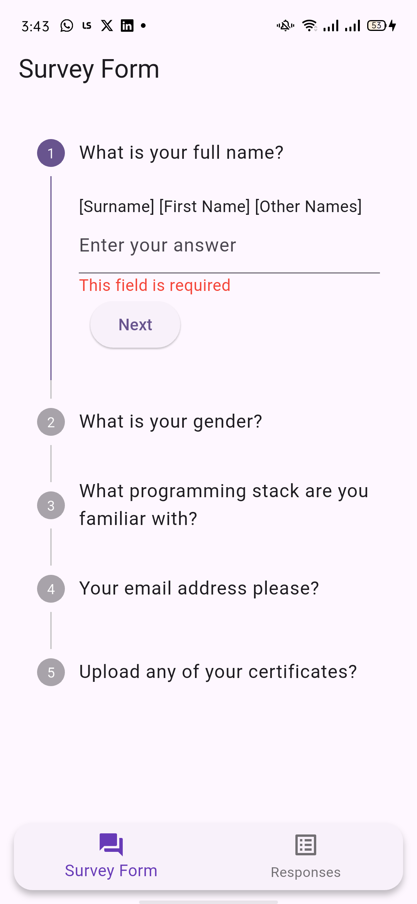
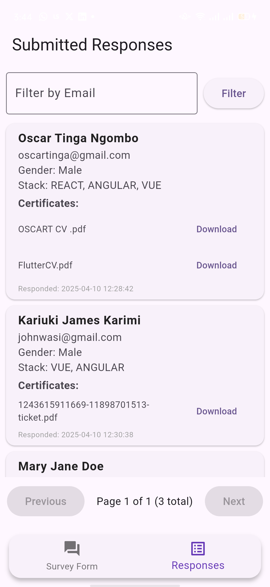

# Simple Survey Client

A Flutter application designed to interact with a simple survey backend API. Users can view survey questions, submit responses (including text, choices, and file uploads), and view previously submitted responses with filtering and pagination.

This project utilizes **GetX** for state management, dependency injection, and navigation, resulting in cleaner and more maintainable code.

## Screenshots

| Survey Form (Steps)                 | Responses List                      | Filter/Pagination                 |
| :----------------------------------: | :---------------------------------: | :-------------------------------: |
|  |  |  |
| *Viewing and answering questions.*   | *Browsing submitted responses.*     | *Filtering and navigating pages.* |

## Features

*   View survey questions fetched from a backend API.
*   Supports multiple question types: Short Text, Long Text, Multiple Choice (Single/Multi-select), File Upload.
*   Step-by-step survey completion using a `Stepper`.
*   Input validation for required fields, email format, etc.
*   Preview responses before final submission.
*   Submit survey responses, including file uploads, to the backend.
*   View a list of previously submitted responses.
*   Paginated display of submitted responses.
*   Filter submitted responses by email address.
*   Download certificate files associated with responses.
*   Pull-to-refresh functionality for the responses list.
*   Clear and user-friendly interface.

## Tech Stack

*   **Flutter:** UI Toolkit for building natively compiled applications.
*   **Dart:** Programming language for Flutter.
*   **GetX:** State Management, Dependency Injection, Route Management.
*   **`http`:** For making network requests to the survey backend.
*   **`file_picker`:** For selecting files to upload.
*   **`GetX`:** For state management and dependency injection.

## Prerequisites

*   Flutter SDK (Version 3.x.x or later recommended) installed. Flutter Installation Guide
*   A configured IDE (like VS Code or Android Studio) with Flutter plugins.
*   A running instance of the corresponding survey backend API. (The default URL configured in the app is `https://13tracso.pythonanywhere.com`).

## Setup and Installation

1.  **Clone the repository:**
    ```bash
    git clone <https://github.com/OscarNgombo/simple_survey_client.git>
    cd simple_survey_client
    ```
2.  **Install dependencies:**
    ```bash
    flutter pub get
    ```
3.  **Configure Backend URL (if necessary):**
    *   Open `lib/main.dart`.
    *   Locate the line where `SurveyClient` is initialized:
        ```dart
        Get.put<SurveyClient>(SurveyClient('YOUR_BACKEND_API_URL'));
        ```
    *   Ensure the URL points to your running backend instance.

## Running the App (Development)

1.  Connect a physical device or start an Android emulator/iOS simulator.
2.  Run the application:
    ```bash
    flutter run
    ```

## Building for Release (APK)

To create a release build of the Android application (APK):

1.  Ensure your Flutter environment is set up for release builds (signing keys, etc.). Flutter Android Build Guide
2.  Run the build command from the project root directory:
    ```bash
    flutter build apk --release
    ```
3.  The output APK file will be located at:
    ```
    build\app\outputs\flutter-apk\app-release.apk
    ```
    *(Note: Path uses backslashes as provided, typical for Windows environments.)*

## Deployment / Distribution (Connecting the APK)

The `app-release.apk` file generated in the previous step is the distributable Android application package.

**To "connect" or share this APK:**

1.  **Locate the File:** Navigate to the `build\app\outputs\flutter-apk\` directory within your project folder.
2.  **Find `app-release.apk`:** This is the file you need to share.
3.  **Distribute:** You can share this `app-release.apk` file using various methods:
    *   **Direct Sharing:** Email, messaging apps, USB transfer (for testing/internal use).
    *   **Cloud Storage:** Upload to Google Drive, Dropbox, etc., and share the link.
    *   **Firebase App Distribution:** A platform for distributing pre-release versions to testers. Firebase App Distribution
    *   **Internal MDM/Enterprise Store:** For corporate distribution.
    *   **Manual Installation:** Users receiving the file will need to enable "Install from unknown sources" in their Android settings to install the APK directly.

**Important:** For public distribution, consider publishing to the Google Play Store, which involves a different process and building an App Bundle (`.aab`) instead of an APK (`flutter build appbundle --release`).

---
